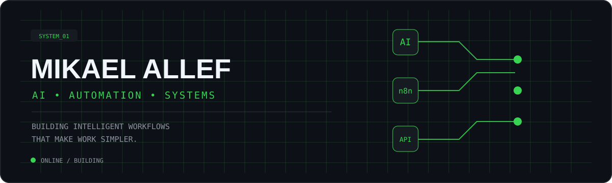

[README.md](https://github.com/user-attachments/files/32291285/README.md)
<div align="center">



<br>

### AI × AUTOMATION × SYSTEMS

**Building intelligent workflows that turn repetitive processes into automated systems.**

<br>

[](SEU_LINKEDIN)
[](https://github.com/MikaelAllef)

</div>

---

## `01 / WHO I AM`

I'm **Mikael Allef**, an AI & Automation enthusiast focused on building practical digital systems.

My work sits at the intersection of **Generative AI, workflow automation and connected systems**, with a strong focus on turning manual processes into reliable automated flows.

> **I don't automate for the sake of automation.  
> I build systems that make work simpler.**

---

## `02 / WHAT I BUILD`

<table>
<tr>
<td width="50%">

### 🤖 AI SYSTEMS

AI-powered solutions designed to understand information, generate content and support real workflows.

</td>
<td width="50%">

### ⚙️ AUTOMATION

Workflows that connect tools, services and business processes with minimal manual intervention.

</td>
</tr>
<tr>
<td>

### 🧠 AI AGENTS

Exploring agent-based architectures capable of reasoning, creating, reviewing and executing tasks.

</td>
<td>

### 🔗 INTEGRATIONS

Connecting APIs, webhooks, applications and AI models into useful digital systems.

</td>
</tr>
</table>

---

## `03 / CORE STACK`

<div align="center">

| AREA | TECHNOLOGIES |
|:---|:---|
| 🤖 **Artificial Intelligence** | Generative AI · LLMs · AI Agents |
| ⚙️ **Automation** | **n8n** · Workflow Design · Process Automation |
| 🔗 **Integration** | REST APIs · Webhooks · API Integration |
| 🌐 **Development** | HTML · CSS · JavaScript |
| 🧩 **Systems** | AI Workflows · Internal Tools · Digital Systems |

</div>

---

## `04 / HOW I THINK`

```text
                         ┌───────────────┐
                         │    PROBLEM    │
                         └───────┬───────┘
                                 │
                                 ▼
                         ┌───────────────┐
                         │  UNDERSTAND   │
                         └───────┬───────┘
                                 │
                                 ▼
                    ┌────────────────────────┐
                    │    DESIGN WORKFLOW     │
                    └────────────┬───────────┘
                                 │
                    ┌────────────┴────────────┐
                    ▼                         ▼
             ┌─────────────┐           ┌─────────────┐
             │     n8n     │◄─────────►│     AI      │
             └──────┬──────┘           └──────┬──────┘
                    │                         │
                    └────────────┬────────────┘
                                 ▼
                         ┌───────────────┐
                         │   INTEGRATE   │
                         └───────┬───────┘
                                 │
                                 ▼
                         ┌───────────────┐
                         │     TEST      │
                         └───────┬───────┘
                                 │
                                 ▼
                         ┌───────────────┐
                         │    IMPROVE    │
                         └───────────────┘
```

---

## `05 / SELECTED PROJECTS`

### `01` — AI Automation System

> **AI + n8n + APIs**

Intelligent workflows designed to automate repetitive operations, connect external services and use AI where human decision-making can be reduced.

**Focus:** `n8n` `AI` `APIs` `Webhooks`

---

### `02` — AI Agent Architecture

> **Agents that collaborate**

Exploring modular AI agents with specialized responsibilities such as strategy, generation, review and execution.

**Focus:** `AI Agents` `LLMs` `Workflows` `Automation`

---

### `03` — Business Automation

> **From manual process → automated workflow**

Systems designed around real operational problems, combining triggers, data processing, integrations and automated actions.

**Focus:** `Process Automation` `n8n` `Integrations`

---

## `06 / CURRENTLY EXPLORING`

```text
[████████████████████░░]  Generative AI
[███████████████████░░░]  n8n Automation
[██████████████████░░░░]  AI Agents
[█████████████████░░░░░]  API Integrations
[████████████████░░░░░░]  Automation Architecture
```

---

## `07 / GITHUB ACTIVITY`

<div align="center">


</div>

---

## `08 / CONNECT`

<div align="center">

**Interested in AI, automation or building something useful?**

<br>

[](SEU_LINKEDIN)

<br><br>

`AI` · `AUTOMATION` · `n8n` · `SYSTEMS`

<br>

<sub>Designed and built by Mikael Allef.</sub>

</div>
